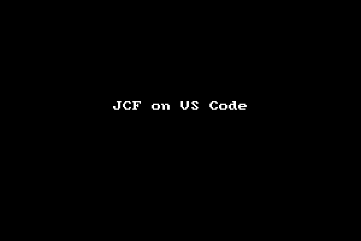

# Pascal Code Formatter (Quadroid JCF Fork)

My fork of [JEDI Code Formatter CLI](https://github.com/git-bee/jcf-cli) from [Bee Jay](https://github.com/git-bee), which itself is a fork of Lazarus JCF, that I intended to slightly modify for better indentation, but gave up on shortly after, realizing how impossible it is to get around in its ancient, complex, and almost completely undocumented code. Still, I managed to implement what I wanted. It’s just hardly can be extended or improved any further given how tricky input source code can be and how difficult it is to target individual edge cases in the AST without breaking something else somewhere.

Changes include:

  * Support for Delphi inline variable declarations:

    ```pascal
    var I: Integer := 10;
    ```

    With type inference:

    ```pascal
    var I := 42;
    ```

    Inside `for` statement:

    ```pascal
    for var I := Low (myArray) to High (myArray) do
    ```

    Source files with inline variables no longer cause formatter to fail.

  * New option `IndentCaseLabels` to control indentation of `case` label statements independently from the whole `case` block. E.g., with `IndentCaseLabels` set to `True` (default):

    ```pascal
    case i of
      1..9:
        for i := 1 to i do write(i, ',');
      10: begin
        writeln;
        writeln;
      end;
      else
        myProcedure;
    end;
    ```

    With `IndentCaseLabels` set to `False`:

    ```pascal
    case i of
    1..9:
      for i := 1 to i do write(i, ',');
    10: begin
      writeln;
      writeln;
    end;
    else
      myProcedure;
    end;
    ```

  * New option `IndentMethodParams`, so it’s possible to write method parameters like this (`IndentMethodParams` set to `False`):

    ```pascal
    function myFunction(aParam: string
    ; aParam2: real): boolean;
    ```

    And avoid second line being indented. Otherwise (set to `True`):

    ```pascal
    function myFunction(aParam: string
      ; aParam2: real): boolean;
    ```

  * New option `IndentInterfaceGuid` to prevent interface GUID from being indented. Set to `True`:

    ```pascal
    IFace = interface
      ['{5E3C2BCA-56C8-46DE-959F-338AF5F69C1A}']
      procedure proc;
    end;
    ```

    Set to `False`:

    ```pascal
    IFace = interface
    ['{5E3C2BCA-56C8-46DE-959F-338AF5F69C1A}']
      procedure proc;
    end;
    ```

  * Formatter now correctly processes line endings inside comments and also avoids formatting control statements with comments in-between them.

  * The formatter source code has been processed through the formatter itself to validate correct function “in the wild”.

Unless I forgot something, all my changes are “tagged” with `// fix:` comments.

Binaries are [available](https://github.com/quadroid/jcf-pascal-format/releases "Download"). The 64-bit Windows build is from FPC. The 32-bit Windows version is built with Delphi. Other operating systems should build with little to no changes.

How to test:

```sh
pascal-format -config=pascal-format.new.cfg -out test.fmt.pas test.pas
```

*TODO:* with GUI now removed, debugging parsed AST is impossible, unless doing it by trial and error. The AST view needs to be rewritten to output in textual form, or, better yet, simply remade in LCL (but without Delphi support). Should be fairly simple to do given it’s basically just a tree view on an empty form.

So here it is in case if someone else wants to waste their time and continue trying to make this thing smarter. Original description follows.

# Jedi Code Formatter CLI

I (Bee Jay) took [Jedi Code Formatter](http://jedicodeformat.sourceforge.net/) (JCF) from [Lazarus IDE repository](https://github.com/graemeg/lazarus/tree/upstream/components/jcf2) and made it as CLI (command line interface) version by removing all the GUI (graphical user interface) parts from the original GUI version. The CLI version can be used as Pascal code formatter in [Visual Studio Code](https://code.visualstudio.com/), or as backend engine of an online [Pascal code beautifier](https://pak.lebah.web.id/jcf).

Original: a copy (sometimes modified) of r823 jcf2 svn tree: https://jedicodeformat.svn.sourceforge.net/svnroot/jedicodeformat/trunk/CodeFormat/Jcf2

Original author: Anthony Steele.

Original license: MPL 1.1.

## How To Build Using Lazarus

1. You must have [Lazarus IDE](http://lazarus-ide.org) already installed on your system.
2. Clone or download this `jcf-cli` GitHub repo into your own folder.
3. Start your Lazarus IDE and open `jcf.lpi` project within `jcf-cli/CommandLine/Lazarus` folder.
4. Build it via Lazarus' **Run** → **Build** menu.
5. Wait while Lazarus is building the JCF project.
6. Take the executable `JCF` file from `jcf-cli/Output/Lazarus` folder along with the `jcf.xml` configuration file.
7. Just to make sure, test it from Terminal using `./JCF -?` command. It should show the usage manual.

## How To Build Using VS Code

1. You must have both [Free Pascal](http://freepascal.org) compiler and [VS Code](https://code.visualstudio.com) already installed on your system.
2. Clone or download this `jcf-cli` GitHub repo into your own folder.
3. Start your VS Code and open `jcf.lpr` project within `jcf-cli/CommandLine/Lazarus` folder.
4. Build it via VS Code's **Tasks** → **Run Task...** → **JCF: Build Release** menu.
5. Wait while FPC is building the JCF project.
6. Open `test.pas` file from `jcf-cli` folder.
7. Test `JCF` program using **Tasks** → **Run Task...** → **JCF: Test CLI Program** menu and you should see the result in the `test.pas` file.

> **Note:** I've included the executable file for Linux, Mac, and Windows in [`Output/Lazarus`](Output/Lazarus) folder so you don't need to build it yourself. However, it's **not** guaranteed using the latest modification. 😊

## How To Use JCF in VS Code

1. Copy the `JCF` **and** `jcf.xml` config files into your Pascal workspace folder.
2. Create a new VS Code task or open the `tasks.json` if you already have one.
3. Copy the task example below and paste it into your `tasks.json` file.

  ```json
  {
    "label"  : "JCF: Beautify Code",
    "type"   : "shell",
    "command": "./JCF",
    "args": [
      "${file}",
      "-clarify",
      "-inplace",
      "-config=jcf.xml"
    ],
    "presentation": {
      "reveal": "never"
    },
    "problemMatcher": []
  },
```
4. It's a task to beautify Pascal code.
5. If you need a task to obfuscate code, simply make another task using the code above, but then change `-clarify` arg into `-obfuscate`.
6. Save your `tasks.json`. Now you should have new JCF's tasks in your tasks list.

## The Problem With JCF

Although JCF is a good Pascal code formatter, it has one single problem that quite annoying. JCF requires the code must be compilable which means it has to be a complete program and syntactically correct. JCF will fail on code snippets or wrong code. To make it works on code snippet, it must be put between a `begin..end` pair and has a correct `program` header, like this:

```pascal
program test;

begin
  // put code snippet here
end.
```

## Demo

Here's JCF CLI in action within VS Code (with [OmniPascal](http://www.omnipascal.com/)):



> **Note:** If you're also interested in my other tasks shown in the demo, see my gist about it [here](https://gist.github.com/pakLebah/dab98067e9a388a3a8d2f5c0b44a7d3f).

Hope it's gonna be useful to other Pascal fellows out there. Have fun! 😊
